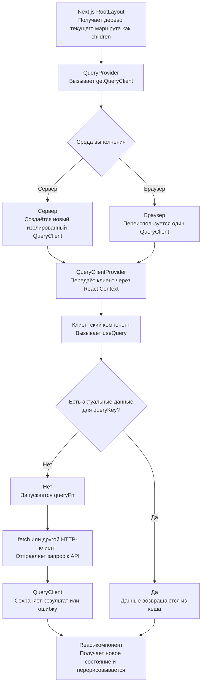

# Отчёт о подключении TanStack Query

## 1. Цель работы

В проект требовалось добавить TanStack Query и подготовить базовую инфраструктуру для будущей
работы с серверным API. На этом этапе конкретные HTTP-запросы, query keys, мутации и контракты
ответов сервера реализовывать не требовалось.

В результате библиотека установлена, `QueryClient` настроен с учётом Next.js App Router и SSR,
провайдер подключён к корневому React-дереву, а правила дальнейшего размещения запросов по FSD
зафиксированы в документации.

## 2. Анализ архитектуры и документации

Перед реализацией были изучены:

- структура слоёв `app`, `features`, `entities` и `shared`;
- корневой `src/app/layout.tsx` и layout-файлы групп маршрутов;
- `docs/README.md`;
- `docs/AUTH.md` с бизнес-сценариями UC-1 — UC-5;
- требования репозитория из `AGENTS.md`;
- текущие зависимости и версии движков из `package.json`.

Согласно FSD ответственность разделена следующим образом:

| Расположение                        | Ответственность                                                      |
| ----------------------------------- | -------------------------------------------------------------------- |
| `src/app/providers/query-provider/` | Подключение глобального React-провайдера на уровне сборки приложения |
| `src/shared/api/query-client/`      | Создание `QueryClient` и общие настройки серверного состояния        |
| `src/entities/<entity>/api/`        | Получение и кеширование данных конкретной бизнес-сущности            |
| `src/features/<feature>/api/`       | Мутации и запросы, связанные с пользовательским сценарием            |

Такое разделение сохраняет направление зависимостей FSD: слой `app` импортирует инфраструктуру
из `shared`, а `shared` ничего не знает о конкретных сущностях, фичах и страницах.

## 3. Установка зависимости

В `dependencies` добавлен пакет:

```json
"@tanstack/react-query": "^5.101.4"
```

Также обновлён `pnpm-lock.yaml`. Установка выполнена зафиксированной в проекте версией
`pnpm 11.4.0`; версии Node.js и pnpm из `engines` не изменялись.

TanStack Query отвечает за управление серверным состоянием:

- хранение результатов запросов в кеше;
- состояния загрузки, успешного ответа и ошибки;
- определение актуальности данных;
- повторные запросы;
- синхронизацию одинаковых данных между компонентами;
- инвалидацию и ручное обновление кеша.

TanStack Query не заменяет `fetch` или Axios. Сетевой запрос в будущем будет выполнять функция
`queryFn` или `mutationFn`, а TanStack Query будет управлять запуском этой функции и её
результатом.

## 4. Созданная структура

Добавлены файлы:

```text
src/
├── app/
│   └── providers/
│       ├── index.ts
│       └── query-provider/
│           ├── QueryProvider.tsx
│           └── index.ts
└── shared/
    └── api/
        ├── index.ts
        └── query-client/
            ├── get-query-client.ts
            └── index.ts
```

Barrel-файлы `index.ts` образуют public API сегментов. Благодаря им потребителям не требуется
импортировать внутренние файлы по глубоким путям.

## 5. Создание и настройка QueryClient

В `src/shared/api/query-client/get-query-client.ts` реализованы две функции:

```ts
export const makeQueryClient = () =>
  new QueryClient({
    defaultOptions: {
      queries: {
        staleTime: 60 * 1000,
      },
    },
  })
```

`makeQueryClient` всегда создаёт новый экземпляр `QueryClient` с общими настройками.

`QueryClient` — это JavaScript-объект, который управляет Query Cache. У каждого экземпляра свой
независимый кеш. Если создать два клиента, данные, сохранённые в первом, не будут доступны во
втором.

`QueryClient` сам по себе не отправляет запросы. Его можно представить как центральный менеджер,
который:

1. принимает настройки запроса;
2. проверяет кеш по `queryKey`;
3. при необходимости запускает `queryFn`;
4. сохраняет полученные данные или ошибку;
5. сообщает подписанным React-компонентам об изменении состояния.

### Настройка staleTime

Для всех query по умолчанию задано:

```ts
staleTime: 60 * 1000
```

В течение одной минуты после успешного получения данных TanStack Query считает их актуальными.
Если другой компонент запросит данные с тем же `queryKey`, клиент сможет вернуть кешированный
результат без немедленного фонового запроса.

Это значение является глобальным значением по умолчанию. Для отдельных запросов его можно будет
переопределять в их query options.

## 6. Назначение getQueryClient

Функция `getQueryClient` выбирает правильный экземпляр клиента для текущей среды выполнения:

```ts
let browserQueryClient: QueryClient | undefined

export const getQueryClient = () => {
  if (environmentManager.isServer()) {
    return makeQueryClient()
  }

  browserQueryClient ??= makeQueryClient()

  return browserQueryClient
}
```

### Выполнение на сервере

На сервере каждый вызов `getQueryClient` создаёт новый `QueryClient`. Сервер может одновременно
обрабатывать запросы разных пользователей, поэтому общий глобальный кеш мог бы привести к
пересечению их данных. Новый клиент изолирует состояние отдельного серверного выполнения.

### Выполнение в браузере

В браузере создаётся один экземпляр `QueryClient`, который затем переиспользуется:

```ts
browserQueryClient ??= makeQueryClient()
```

Оператор `??=` присваивает значение только в том случае, если переменная равна `null` или
`undefined`. Поэтому первый вызов создаёт клиент, а последующие возвращают уже существующий.

Это позволяет сохранить кеш:

- между повторными рендерами компонентов;
- при переходах между маршрутами;
- при использовании одного `queryKey` в нескольких компонентах.

Если бы `new QueryClient()` выполнялся непосредственно при каждом рендере `QueryProvider`, мог
бы создаваться новый пустой кеш и ранее загруженные данные терялись бы.

## 7. Реализация QueryProvider

В `src/app/providers/query-provider/QueryProvider.tsx` создан клиентский React-компонент:

```tsx
'use client'

export const QueryProvider = ({ children }: PropsWithChildren) => {
  const queryClient = getQueryClient()

  return <QueryClientProvider client={queryClient}>{children}</QueryClientProvider>
}
```

Директива `'use client'` необходима, потому что `QueryClientProvider` использует React Context.

Компонент выполняет три действия:

1. получает подходящий экземпляр через `getQueryClient()`;
2. передаёт его в библиотечный `QueryClientProvider` через проп `client`;
3. рендерит вложенное React-дерево через `children`.

## 8. Что такое children и зачем он нужен провайдеру

`children` — специальный React-проп, содержащий элементы, записанные между открывающим и
закрывающим тегами компонента.

Эти две записи эквивалентны:

```tsx
<QueryProvider>{children}</QueryProvider>
```

```tsx
<QueryProvider children={children} />
```

Тип `PropsWithChildren` добавляет компоненту проп следующего вида:

```ts
children?: React.ReactNode
```

В данном проекте первоначальное содержимое `children` формирует маршрутизатор Next.js. Корневой
`RootLayout` получает дерево текущего открытого маршрута, а не список всех страниц проекта.

Например, для `/sign-in` дерево можно представить так:

```text
RootLayout
└── children: (auth)/layout.tsx
    └── children: (auth)/sign-in/page.tsx
        └── SignInForm
```

Корневой layout передаёт это дерево в `QueryProvider`, а тот — в `QueryClientProvider`.

Упрощённо библиотечный провайдер работает так:

```tsx
function QueryClientProvider({ client, children }) {
  return <QueryClientContext.Provider value={client}>{children}</QueryClientContext.Provider>
}
```

Он не изменяет `children` и не выполняет содержащиеся в них запросы автоматически. Провайдер
помещает `QueryClient` в React Context и определяет область, внутри которой клиентские
компоненты смогут использовать `useQuery`, `useMutation` и `useQueryClient`.

## 9. Подключение в RootLayout

Корневой `src/app/layout.tsx` изменён следующим образом:

```tsx
<html lang='en' className={inter.variable}>
  <body>
    <QueryProvider>{children}</QueryProvider>
  </body>
</html>
```

Провайдер подключён на самом верхнем уровне приложения. Поэтому React-дерево любого текущего
маршрута оказывается внутри одного `QueryClientProvider` и получает доступ к общему браузерному
кешу.

Передача компонентов в провайдер не даёт им саму возможность отправлять HTTP-запросы: `fetch`
можно вызывать и без TanStack Query. Провайдер предоставляет дополнительную инфраструктуру для
управления запросами и полученными серверными данными.

## 10. Будущая работа useQuery

Сейчас `useQuery` в проекте не используется, потому что реальные операции чтения API ещё не
реализованы. Провайдер и клиент остаются готовой инфраструктурой для следующего этапа.

Будущий запрос может выглядеть следующим образом:

```tsx
'use client'

import { useQuery } from '@tanstack/react-query'

const Profile = () => {
  const { data, isPending, isError } = useQuery({
    queryKey: ['profile'],
    queryFn: async () => {
      const response = await fetch('/api/profile')

      if (!response.ok) {
        throw new Error('Failed to load profile')
      }

      return response.json()
    },
  })

  // Отображение pending, error или полученных данных.
}
```

Роли частей этого примера:

- `queryKey` — уникальный адрес данных в Query Cache;
- `queryFn` — функция, непосредственно выполняющая запрос;
- `useQuery` — подписывает компонент на состояние query;
- `QueryClient` — управляет запуском, кешем, актуальностью данных и ошибками;
- `QueryClientProvider` — делает клиент доступным через React Context.

`useQuery` предназначен прежде всего для чтения серверного состояния, которое требуется
кешировать и синхронизировать. Для операций изменения данных (`POST`, `PATCH`, `DELETE`) обычно
используется `useMutation`, после чего связанные query обновляются или инвалидируются.

## 11. Общая схема работы



Текущее состояние реализации заканчивается на блоке `QueryClientProvider`. Последующие блоки
начнут участвовать в работе после появления конкретных query и серверного API.

## 12. Документация

Создан файл `docs/TANSTACK_QUERY.md`, в котором зафиксированы:

- назначение TanStack Query в проекте;
- размещение инфраструктуры по слоям FSD;
- правила размещения будущих query и mutations;
- серверное и браузерное поведение `QueryClient`;
- рекомендации по query keys, `queryOptions`, инвалидации и SSR-prefetch.

Файл добавлен в оглавление `docs/README.md`.

Тексты ошибок и пользовательских уведомлений будущих запросов должны браться из соответствующей
бизнес-спецификации. Например, для регистрации, входа, восстановления пароля и выхода источником
истины остаётся `docs/AUTH.md`, UC-1 — UC-5.

## 13. Что намеренно не реализовано

На этом этапе не добавлялись:

- конкретные `useQuery` и `useMutation`;
- HTTP-клиент и базовый URL API;
- query keys предметных сущностей;
- типы запросов и ответов сервера;
- обработка кодов ошибок API;
- авторизационные заголовки и обновление токенов;
- серверный prefetch, `dehydrate` и `HydrationBoundary`;
- React Query Devtools.

Эти части зависят от будущего контракта серверного API. Их преждевременная реализация привела
бы к появлению вымышленных endpoint, DTO и правил обработки ошибок.

## 14. Выполненные проверки

После реализации выполнены:

- форматирование изменённых файлов через Prettier;
- ESLint-проверка добавленных и изменённых TypeScript-файлов;
- проверка TypeScript командой `tsc --noEmit`;
- production-сборка Next.js;
- проверка diff на пробелы и ошибки форматирования через `git diff --check`.

Итоговая TypeScript-проверка и production-сборка завершились успешно. Верхнеуровневый скрипт
`pnpm lint` не использовался, поскольку в проекте существует документированная предшествующая
проблема: Next.js 16 удалил команду `next lint`, а скрипт пока не переведён на `eslint .`.

## 15. Рекомендуемые следующие шаги

После появления спецификации API можно последовательно реализовать:

1. общий HTTP-клиент в `shared/api`;
2. типизированную модель ошибок API;
3. сущность текущего пользователя в `entities/user`;
4. query options профиля в `entities/user/api`;
5. мутации регистрации и входа в соответствующих слайсах `features/auth`;
6. инвалидацию пользовательских данных после изменения профиля или авторизации;
7. SSR-prefetch и гидратацию для страниц, которым нужны данные до клиентского рендера;
8. Storybook/Vitest-сценарии для состояний pending, success и error.

При реализации аутентификации необходимо сверять каждую операцию с конкретным use case и шагом
из `docs/AUTH.md`.
